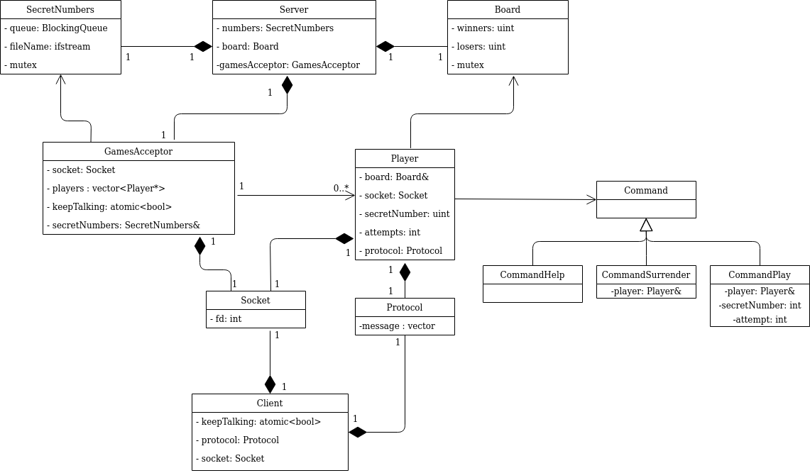

# Informe del Trabajo Práctico 3
### Alumno: Francisco Ruiz. Padrón:99429
### Link: https://github.com/FRuiz811/tp3.git

En el siguiente informe se presentará un resumén de como se encaró la 
resolución del problema planteado en el trabajo práctico. Se adjuntarán 
diagramas descriptivos que intentarán ayudar a la explicación del mismo.
Por último, detallaré algunos inconvenientes a los cuales me enfrente y cómo 
resolví la cuestión.

## Descripción de la Resolución

El siguiente diagrama nos presenta un pantallazo general de como está 
conformada la solución para el trabajo práctico. Si bien no está a nivel de 
implementación (se ignora la clase Thread), se puede observar a grandes rasgos 
las relaciones entre las distintas clases:

La solución se basó en armar una arquitectura cliente-servidor en la cuál el 
servidor pueda comunicarse con varios clientes a la vez. Para poder aplicar 
esto, se utilizaron threads para implementar a las clases GamesAcceptor y 
Player. 

El cliente es bastante sencillo, simplemente envía los comandos ingresados por 
el usuario y luego de encodearlo con el protocolo, lo envía al servidor y 
aguarda la respuesta de este, para luego mostrarlo por pantalla.

El servidor, en cambio, se deshace en varios hilos. El principal, es el 
encargado de lanzar el GamesAcceptor, y se quedará esperando a que por entrada 
estándar se ingrese una 'q' que determinará el cierre del servidor. Este 
cierre no es polite para el aceptador, dado que se le cierra el Socket para 
que no acepte más clientes. Una vez hecho esto, se imprimirán las estadísticas 
recolectadas durante todas las partidas.

El GamesAcceptor una vez lanzado, quedará a la espera de que lleguen los 
distintos clientes, lanzando un hilo Player cada vez que se conecte alguno. 
Como vimos, GamesAcceptor aceptará rivales hasta que se lo indique el hilo 
principal del server. A medida que va lanzando a los Players, les cede el 
control del socket aceptado, y les da el número con el cuál jugarán con el 
cliente. Una vez hecho esto, recorrerá a todos los Players y eliminará 
aquellos que ya finalizaron su labor. 

Por último, están los hilos Player. Estos son los que establecen el contacto 
con los clientes. A medida que van recibiendo los comandos, se utilizará del 
polimorfismo para ejecutarlos (CommandHelp, CommandSurrender y CommandPlay), 
donde cada uno hará su trabajo y devolverá el mensaje que tenga para el 
cliente. En caso del CommandPlay, es el encargado de verificar toda la lógica 
del juego y de ir aumentando los intentos que realiza el cliente.
Esta comunicación seguirá hasta que se llegue al máximo de intentos, el 
cliente gane, se rinda o se le indique al Player, de manera polite, que deje 
de hablar con el cliente. 

## Aclaraciones

### Sobrecargar el operador()

Uno de los requisitos del trabajo era sobrecargar el operador(), esto se 
realizó en la clase SecretNumbers, que es la encargada de realizar el 
procesamiento del archivo de números secretos y mantenerlos en una queue a 
disposición de los Players. Podemos ver que el operador() nos dará el próximo 
número secreto que se encuentre en la queue y a su vez, lo volverá a ingresar 
en la cola bloqueante para que no se pierda el formato Round Robin.

### Cierre forzado del cliente

En el desarrollo, observe que el cliente podía forzar su detención utilizando 
CTRL+C. Esto hacía que la partida que se esté jugando contra ese cliente quede 
en el olvido. Por lo tanto, asumí que si un cliente se cierra como CTRL+C 
pierde la partida automáticamente y en el tablero de las estadíasticas se 
agrega un perdedor más.

## Correcciones Segunda Entrega

+ Se agregó el uso de macros para textos. Se documentó los métodos que no 
tenían su documentación correspondiente y la clase Command quedó inline debido 
a que los métodos estaban vacíos. También se devuelven los mensajes encodeados 
por el protocolo por movimiento.

+ Se eliminó el uso del buffer de tamaño fijo. Se cambió el momento de creación
del vector y queda ligado a aquello que se recibe en los primeros 4 bytes del 
mensaje, estos indican la longitud que tendrá el mensaje a continuación. Por lo
tanto, se crea el vector con ese tamaño + 1 y se lo inicializa en 0.

+ Se agregaron locks en funciones que no estaban siendo atómicas y que se les 
permitía a otros threads realizar modificaciones sobre ciertas variables que 
estaban sido mostradas por estas funciones. Se agregó la keyword mutable a los 
mutex para no perder la condición de que el método sea constante, como por 
ejemplo en Board::show_results(), BlockingQueue:is_open() y 
BlockingQueue::empty().

+ En algunos constructores por movimiento, se los hicieron atómicos para 
evitar que se hagan modificaciones al momento de estar moviendolo.
